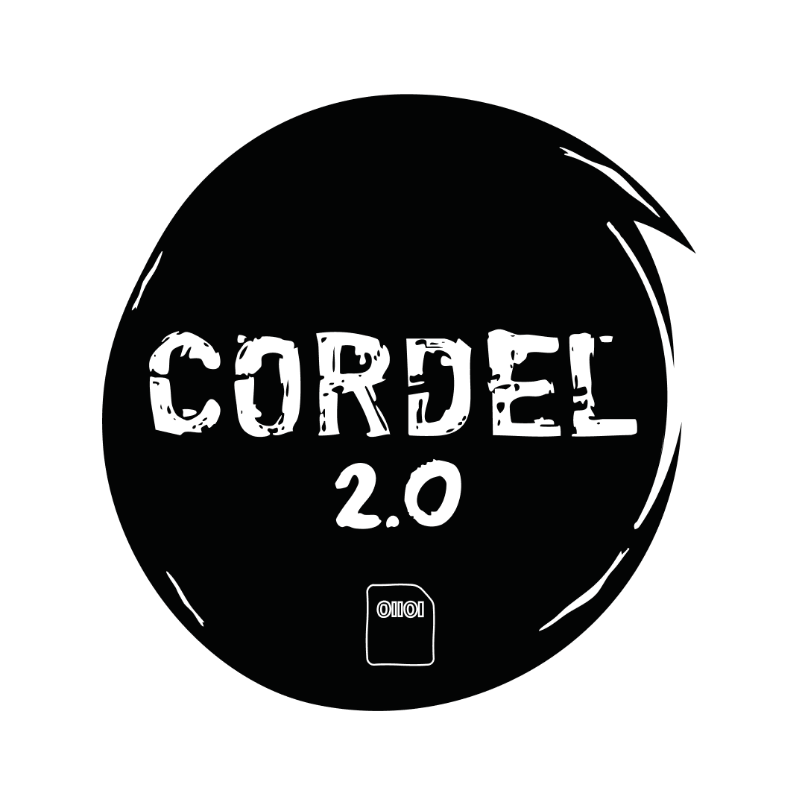

<div align="center">



# Registro Coletivo

### Um registro vivo de escrita popular e xilogravura, ancorado no chão onde cada obra nasce

[](#estado-honesto-do-projeto)
[](#o-primeiro-território)
[](https://www.openstreetmap.org/copyright)
[](LICENSE.md)

[Visitar o território](https://territorio.cordel2pontozero.com) · [Apresentação](./docs/APRESENTACAO.md) · [Cordel 2.0](https://www.cordel2pontozero.com)

</div>

---

## Uma obra não nasce em lugar nenhum

Um cordel fala de uma praça. Uma xilogravura guarda uma feira. Uma sextilha nomeia a
esquina onde alguém esperou. Quando essas obras são catalogadas, o lugar costuma virar uma
linha de metadado - "Salvador, BA" - e o chão desaparece.

O **Registro Coletivo** faz o contrário: **ancora cada obra no lugar que ela cita**, e
oferece à comunidade um **construtor de espaços culturais em 3D** para erguer, sem escrever
código, os lugares nomeados nas obras.

> **O acervo é o sistema de registro; o 3D é vista.**
> Se o construtor cair, o registro continua de pé.

## As duas metades

| | O que é |
|---|---|
| **O registro** | O acervo de obras - cordéis, xilogravuras, escrita popular - com autoria, procedência e vínculo com o território que a obra cita. É o sistema de verdade. |
| **O construtor** | Uma ferramenta para a comunidade levantar em 3D os lugares citados: a praça, o mercado, o terreiro, o campo. Sem programar. |

A fonte de verdade é **agnóstica de motor** - coordenadas em JSON e peças em formatos
abertos. O território pode ser reaberto em outro programa sem depender deste código.

## O primeiro território

O entorno do **Espaço Cultural Alagados**, em Salvador.

O chão foi levantado a partir de **dados abertos** e há **uma obra ancorada**: o cordel de
**Dilma Santana**, citado da antologia da Primeira Edição Alagados
(ISBN 978-65-89484-02-8).

A Cordel 2.0 já trabalhou neste território - de **março a junho de 2025**, dentro do
próprio Espaço Cultural. O vínculo com o lugar é real e anterior ao software.

## Estado honesto do projeto

Este é um **protótipo**, e vale dizer com todas as letras o que ainda não aconteceu:

- **nenhum lugar foi erguido pela comunidade** - o construtor não teve oficina ainda;
- **nenhum marco foi colocado** por moradores;
- **não há parceria formalizada** com nenhuma instituição;
- **o nome definitivo do MVP será batizado com a comunidade**, não no escritório.

O que existe hoje: o território navegável, uma obra ancorada, a base cartográfica tratada e
o desenho completo do produto. **A plataforma de território é nova.** O trabalho no lugar é
que não é.

Dizemos isso porque um projeto de base comunitária que exagera o próprio alcance começa
devendo à comunidade.

## Decisões que definem o produto

**Site estático puro.** Sem backend, sem conta, sem cookie, sem analytics e sem nenhuma
requisição a terceiros na visita. Quem entra no território não é medido.

**A cena não carrega junto com a página.** Quem chega vê um cartaz leve e decide se quer
entrar. O alvo declarado é um **Android de entrada em rede 3G** - não um desktop de
escritório.

**Dados abertos, atribuídos.** A base cartográfica vem do OpenStreetMap, sob **ODbL**, com
atribuição no rodapé.

**Escrita só quando houver escrita.** O backend só entra quando a comunidade começar a
enviar obras e erguer lugares. Até lá, não há dado de ninguém guardado em lugar nenhum.

## Verificação como método

O projeto trata conferência como parte do produto, não como etapa final:

- a projeção cartográfica é auditada por **fórmula diferente** da usada para gerar a cena;
- o texto de cada obra é conferido **caractere por caractere** contra o original - qualquer
  diferença é tratada como falha grave;
- o peso de cada página é medido e convertido em **segundos a 400 kbps**;
- há varredura de credenciais antes de qualquer publicação.

Conferir o poema contra o original não é preciosismo: **publicar errado o verso de alguém é
apagar a pessoa enquanto se diz preservá-la.**

## Como o Registro Coletivo entra na formação

A Cordel 2.0 é uma startup de **formação, consultoria e design pedagógico**. O que
entregamos é aprendizado; o software é o meio pelo qual ele acontece.

| Frente | Como entra |
|---|---|
| **B2B** | Institutos, museus e organizações culturais: acervo territorial de coleções e programas de residência. |
| **B2G** | Secretarias de cultura e educação, bibliotecas e pontos de cultura: registro de patrimônio vivo com participação comunitária. |
| **B2C** | Coletivos, poetas e xilógrafos: um lugar para ancorar a própria obra no próprio chão. |

Nas oficinas, erguer em 3D a praça citada no cordel é a atividade que ensina, ao mesmo
tempo, leitura, escrita, cartografia e letramento digital.

## Tecnologia

```text
┌──────────────────────────────────────────────────────────────┐
│ Experiência: acervo · território navegável · ponto de imersão │
├──────────────────────────────────────────────────────────────┤
│ Site: Astro · estático puro · sem backend na visita          │
├──────────────────────────────────────────────────────────────┤
│ Cena: geometria em JS puro · Three.js só como cola           │
├──────────────────────────────────────────────────────────────┤
│ Dados: OpenStreetMap (ODbL) · cena compacta em JSON          │
├──────────────────────────────────────────────────────────────┤
│ Verificação: auditoria de projeção · conferência de obra     │
└──────────────────────────────────────────────────────────────┘
```

## O ecossistema Cordel 2.0

O Registro Coletivo é um dos cinco softwares próprios da Cordel 2.0:

| Software | O que é |
|---|---|
| [**ARARA**](https://github.com/Cordel2pontozero/arara-apresentacao-oficial) | Trilhas de escrita e correção de redação ENEM |
| [**INANNA**](https://github.com/Cordel2pontozero/Inanna-apresentacao-oficial) | Jogo de cordel que torna visível a previsão da próxima palavra |
| [**TICA**](https://github.com/Cordel2pontozero/tica-apresentacao-oficial) | Chatbot reflexivo de escrita guiada |
| **Registro Coletivo** | Território, xilogravura e construtor 3D - *este repositório* |
| [**Dataset Popular Brasileiro**](https://github.com/Cordel2pontozero/dataset-popular-Brasileiro) | Dataset aberto de cultura popular |

## Sobre este repositório

Este repositório contém **apenas a página de apresentação** do Registro Coletivo. O código
da plataforma é mantido separadamente.

## Identidade e contato

<div align="center">

**Cordel 2.0 - Educação, Cultura e Inovação** - CNPJ 68.110.384/0001-39
Formação em letramento digital com softwares próprios
Salvador - Bahia - Brasil

[www.cordel2pontozero.com](https://www.cordel2pontozero.com) · [contato@cordel2pontozero.com](mailto:contato@cordel2pontozero.com)

</div>

## Licenciamento

Textos institucionais, identidade visual e materiais autorais desta apresentação seguem
**CC BY-ND 4.0** - ver [LICENSE.md](LICENSE.md).

A base cartográfica do território provém do **OpenStreetMap**, sob
[ODbL](https://www.openstreetmap.org/copyright). As obras registradas permanecem de autoria
de seus criadores.

Parcerias, oficinas e pilotos: **contato@cordel2pontozero.com**.
